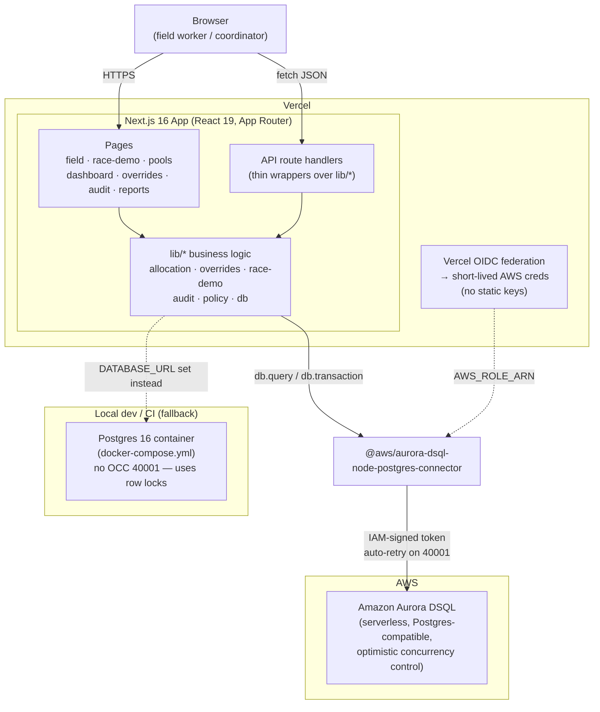
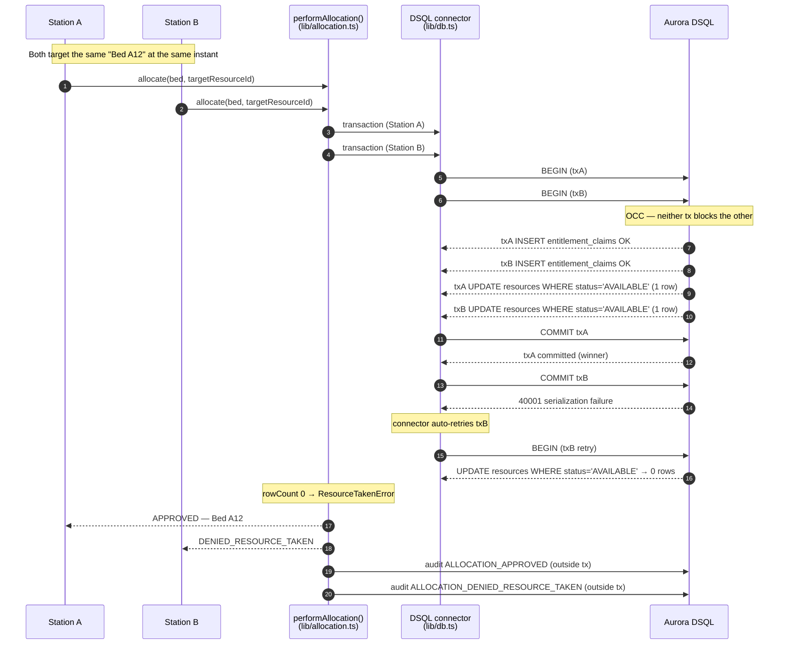
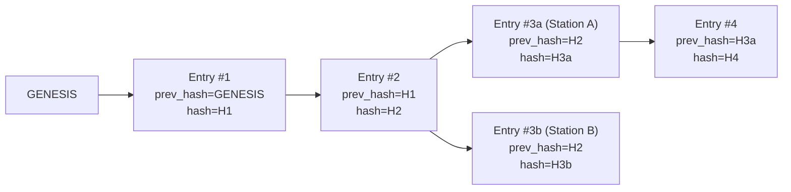

# AidLockIn — Architecture

A shared allocation ledger for disaster aid, built on the AWS Databases + Vercel
track: **Next.js 16 / React 19** on **Vercel**, **Amazon Aurora DSQL** as the
database, hand-written SQL, no ORM. All concurrency correctness lives in two
database-enforced mechanisms — a unique index and conditional `UPDATE`s — not in
application-level locking. See `lib/allocation.ts`, `lib/db.ts`, and
`db/schema.sql` for the canonical source.

---

## 1. System, components, and deployment

The browser talks to a Next.js app running as Vercel Functions. All business
logic sits in framework-agnostic `lib/*` modules; the API route handlers are
thin wrappers. A single `lib/db.ts` entry point talks to **either** Aurora DSQL
(production) **or** a plain Postgres 16 container (local dev / CI) behind one
interface — application code never branches on which backend it's using.



**Deployment notes.**

- `lib/db.ts` selects the DSQL backend when `PGHOST` or `DSQL_ENDPOINT` is set,
  otherwise the plain-Postgres backend from `DATABASE_URL`.
- On Vercel, the Aurora DSQL Marketplace integration sets `PGHOST` / `PGUSER` /
  `PGDATABASE` / `PGPORT` / `AWS_REGION` / `AWS_ROLE_ARN`, and Vercel OIDC
  federation exchanges an OIDC token for short-lived AWS credentials — no static
  access keys. `@vercel/functions` `attachDatabasePool` keeps the function warm
  enough for idle pooled connections to drain cleanly.
- The plain-Postgres path is for local dev and CI only. It reproduces the entire
  app **except** DSQL's commit-time `40001` semantics (it resolves contention
  with row locks instead) — see `DSQL_SETUP.md`.

---

## 2. Entity-relationship diagram

> **App-enforced relationships, not real foreign keys.** Aurora DSQL supports no
> foreign keys, triggers, or PL/pgSQL, so every "reference" column below is a
> plain `UUID`. Referential integrity is enforced in the application layer
> (`lib/allocation.ts`), not the schema. The relationships drawn here are the
> *conceptual* links the code maintains, not database-level constraints. The one
> real structural guarantee in the schema is the **unique index** on
> `entitlement_claims`, which is what makes duplicate prevention race-safe.

```mermaid
erDiagram
  organizations ||..o{ event_partners : "participates via"
  disaster_events ||..o{ event_partners : "has"
  disaster_events ||..o{ households : "scopes"
  disaster_events ||..o{ aid_types : "defines"
  aid_types ||..|| aid_policies : "governed by"
  aid_types ||..o| resource_pools : "POOL model stock"
  aid_types ||..o{ resources : "UNIT model units"
  disaster_events ||..o{ entitlement_claims : "scopes"
  households ||..o{ entitlement_claims : "holds (unique per window)"
  aid_types ||..o{ entitlement_claims : "for"
  entitlement_claims ||..o| allocations : "linked to"
  disaster_events ||..o{ allocations : "scopes"
  households ||..o{ allocations : "received by"
  aid_types ||..o{ allocations : "of"
  resource_pools ||..o{ allocations : "drawn from"
  resources ||..o| allocations : "claimed by"
  organizations ||..o{ allocations : "allocated by"
  disaster_events ||..o{ allocation_attempts : "scopes"
  households ||..o{ allocation_attempts : "for"
  allocation_attempts ||..o| override_requests : "may trigger"
  households ||..o{ override_requests : "concerns"
  organizations ||..o{ override_requests : "requested by"
  disaster_events ||..o{ audit_events : "scopes"

  organizations {
    uuid id PK
    text name
    text org_type "NGO GOV DONOR OTHER"
  }
  disaster_events {
    uuid id PK
    text name
    text status "ACTIVE CLOSED"
  }
  event_partners {
    uuid id PK
    uuid event_id "app-ref disaster_events"
    uuid organization_id "app-ref organizations"
  }
  households {
    uuid id PK
    uuid event_id "app-ref disaster_events"
    text claim_code "unique per event"
    boolean vulnerable
  }
  aid_types {
    uuid id PK
    uuid event_id "app-ref disaster_events"
    text code "unique per event"
    text resource_model "POOL UNIT"
  }
  aid_policies {
    uuid id PK
    uuid aid_type_id "app-ref aid_types (unique)"
    text window_type "HOURS DAYS EVENT ACTIVE"
    int window_value
  }
  resource_pools {
    uuid id PK
    uuid aid_type_id "app-ref aid_types (unique)"
    int total_quantity
    int remaining_quantity
  }
  resources {
    uuid id PK
    uuid aid_type_id "app-ref aid_types"
    text label "e.g. Bed A12"
    text status "AVAILABLE ALLOCATED"
  }
  entitlement_claims {
    uuid id PK
    uuid household_id "app-ref households"
    uuid aid_type_id "app-ref aid_types"
    text policy_window_bucket
    boolean is_override
    uuid allocation_id "app-ref allocations"
  }
  allocations {
    uuid id PK
    uuid household_id "app-ref households"
    uuid aid_type_id "app-ref aid_types"
    uuid resource_id "app-ref resources"
    uuid pool_id "app-ref resource_pools"
    text status "ACTIVE OVERRIDDEN CANCELLED"
  }
  allocation_attempts {
    uuid id PK
    text household_claim_code
    text result "APPROVED DENIED_* ERROR"
    text denial_reason
    text simulated_region "race-demo only"
  }
  override_requests {
    uuid id PK
    uuid household_id "app-ref households"
    text status "PENDING APPROVED REJECTED"
    text reason
  }
  audit_events {
    uuid id PK
    bigint audit_no "uncached sequence"
    text action
    text payload "TEXT not JSONB for hash fidelity"
    text prev_hash
    text hash
  }
```



The unique index that carries the duplicate-prevention guarantee:

```sql
CREATE UNIQUE INDEX uq_entitlement_claim
  ON entitlement_claims (event_id, household_id, aid_type_id, policy_window_bucket);
```

---

## 3. Allocation flow (with the race case)

Every "Check & allocate" tap runs through `performAllocation()`, which records a
`PENDING` attempt, then runs `runAllocationCore` inside `db.transaction(...)`:
(1) insert into `entitlement_claims` (the unique index is the dedup enforcement),
(2) consume the resource via a conditional `UPDATE`, (3) write the `allocations`
ledger row. The attempt is then marked `APPROVED` or a specific denial, and an
audit event is appended **outside** the transaction so denials survive a
rollback.

The sequence below shows the **race case**: two stations contending for one bed.
On Aurora DSQL both transactions proceed optimistically; the second to commit
hits `40001`; the connector retries it; the retry sees the committed winner and
its conditional `UPDATE` matches zero rows → a clean `DENIED_RESOURCE_TAKEN`.



For the **duplicate** case the shape is the same, but the collision happens one
step earlier: the second transaction's `INSERT INTO entitlement_claims` violates
`uq_entitlement_claim` (Postgres `23505`), which `runAllocationCore` maps to a
`DuplicateEntitlementError` → `DENIED_DUPLICATE`. On plain Postgres the resource
contention resolves via row locks rather than a `40001` retry, but the observable
outcome — exactly one winner — is identical.

---

## 4. Audit hash-chain

Every approval and denial appends one row to `audit_events` via
`appendAuditEvent` (`lib/audit.ts`), always as its **own** statement — never
inside the allocation transaction it audits, so a rolled-back denial still leaves
a permanent record.

Each row computes its `hash` as `sha256(prev_hash ‖ action ‖ detail ‖ payload ‖
created_at)`, where `prev_hash` is the `hash` of the most recent prior row for the
same event (or the literal `GENESIS` for the first). So each row commits to the
one before it, and editing or deleting any historical row changes (or removes)
its hash, which breaks every later row that cites it — that's the
tamper-evidence.



`verifyAuditChain` (`lib/audit.ts`) deliberately verifies a **DAG, not a single
line**. Two allocation attempts can be in flight at the same instant — that is
the entire point of the race demo — so two audit rows can legitimately cite the
same `prev_hash` (above, #3a and #3b both fork from `H2`). The verifier walks
rows oldest-first by `audit_no` and accepts a row when its `prev_hash` is
`GENESIS` or the hash of some earlier row that already checked out, and when its
own contents rehash to its stored `hash`. So legitimate concurrent forks pass,
while any edited or deleted historical row fails verification — concurrency and
tamper-evidence without forcing a false choice between them.

> `audit_events.payload` is stored as **TEXT, not JSONB**, so the exact bytes that
> were hashed are the exact bytes rehashed at verification time — JSONB would
> normalize key order on cast-back and break the chain. `audit_no` comes from an
> **uncached sequence** (`audit_seq`) so the ordering key can't be inverted by a
> pooled connection sitting on a stale cached block.
